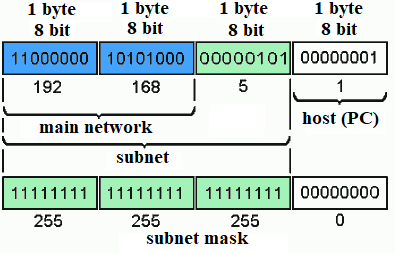

# Сети в Linux

> При старте работы над проектом просим вас постараться хронометрировать время работы над проектом.
> По завершении работы над проектом просим вас ответить на два вопроса [в этом опросе](https://forms.gle/x9fFrF7nTM7LmNLK8)

Настройка сетей в Linux на виртуальных машинах.


## Contents

1. [Chapter I](#chapter-i)
2. [Chapter II](#chapter-ii) \
   2.1. [Стек протоколов TCP IP](#стек-протоколов-tcp-ip) \
   2.2. [Адресация](#адресация) \
   2.3. [Маршрутизация](#маршрутизация)
3. [Chapter III](#chapter-iii) \
   3.1. [Инструмент ipcalc](#part-1-инструмент-ipcalc) \
   3.2. [Статическая маршрутизация между двумя машинами](#part-2-статическая-маршрутизация-между-двумя-машинами) \
   3.3. [Утилита iperf3](#part-3-утилита-iperf3) \
   3.4. [Сетевой экран](#part-4-сетевой-экран) \
   3.5. [Статическая маршрутизация сети](#part-5-статическая-маршрутизация-сети) \
   3.6. [Динамическая настройка IP с помощью DHCP](#part-6-динамическая-настройка-ip-с-помощью-dhcp) \
   3.7. [NAT](#part-7-nat) \
   3.8. [Допополнительно. Знакомство с SSH Tunnels](#part-8-дополнительно-знакомство-с-ssh-tunnels)
4. [Chapter IV](#chapter-iv)


## Chapter I


Планета Земля, США, штат Калифорния, Комптон, джаз клуб "Seb's", наши дни.

\> *В баре играет новая джаз-группа. Их музыка чуть энергичнее, чем Вы привыкли, но в таланте им не откажешь.*

`—` Себастиан, ты отсидел уже неделю за столом в офисе. Как считаешь, ты научился работать в Linux'е? Впрочем, учитывая что ты опять мне позвонил посреди недели, думаю я и так знаю ответ...

`—` Постепенно разбираюсь, но явно не так быстро, как хотелось бы.

`—` Готов ли ты завтра выйти на работу?

`—` Я не понимаю, не понимаю, дружище. Мне говорят заняться настройкой сетей. Но для меня это просто слова. Я хочу встретить молодого себя, когда я был глупым мальчишкой, который согласился пойти на работу сисадмином, отговорить его, объяснить, что к чему, но не могу. Что же делать, дружище?

`—` Ну, ну, не стоит отчаиваться. Настройка сетей не так и страшна. Я с радостью расскажу тебе о ней, если ответишь на один вопрос: почему твой отец вообще устроил тебя именно сисадмином? Мы ведь в его баре сидим, почему не сюда? Это куда уж легче.

`—` Я не знаю, кто разберет этого старика. Говорит что-то про самостоятельность и расширение кругозора...

`—` Хорошо, тогда продолжим расширять твой кругозор. Доставай ноутбук, поднимай виртуальную машину, покажу что и как.

\> *Новичков сменяют постоянные музыканты бара, музыка замедляется, официант все никак не принесет вам ваш заказ.*

\> *Пока Себастиан неуверенно поднимает виртуальную машину, Вы решаете поделиться основной информацией о сетях на Linux.*


## Chapter II

### Стек протоколов TCP IP

Собственно, что есть сеть? Сеть - это более 2х компьютеров, объединенных между собой какими-то каналами связи, в более сложном примере - каким-то сетевым
оборудованием и обменивающиеся между собой информацией по определенным правилам. Эти правила "диктуются" стеком протоколов **TCP/IP**.

Transmission Control Protocol/Internet Protocol (Стек протоколов **TCP/IP**) - если сказать простым языком, это набор взаимодействующих протоколов разных 
уровней (каждый уровень взаимодействует с соседним, то есть состыковывается, поэтому и стек), согласно которым происходит обмен данными в сети. 
Итого, стек протоколов **TCP/IP** - это набор наборов правил :) Тут может возникнуть 
резонный вопрос: а зачем же иметь много протоколов? Неужели нельзя обмениваться всем по одному протоколу?

Все дело в том, что каждый протокол описывает строго отведенные ему правила. Кроме того, протоколы разделены по уровням функциональности, что позволяет работе 
сетевого оборудования и программного обеспечения становиться гораздо проще, прозрачнее и выполнять "свой" круг задач. Для разделения данного набора протоколов 
по уровням была разработана модель сетевого взаимодействия **OSI** (англ. Open Systems Interconnection Basic Reference Model, 1978 г., она же - базовая эталонная 
модель взаимодействия открытых систем). Модель **OSI** состоит из семи различных уровней. Уровень отвечает за отдельный участок в работе коммуникационных систем, 
не зависит от рядом стоящих уровней – он только предоставляет определённые услуги. Каждый уровень выполняет свою задачу в соответствии с набором правил, 
называемым протоколом.

### Адресация

В сети, построенной на стеке протоколов **TCP/IP** каждому хосту (компьютеру или устройству подключенному к сети) присвоен IP-адрес. 
IP-адрес представляет собой 32-битовое двоичное число. 
Удобной формой записи IP-адреса (**IPv4**) является запись в виде четырёх десятичных чисел (от 0 до 255), разделённых точками, например, *192.168.0.1*. 
В общем случае, IP-адрес делится на две части: адрес сети (подсети) и адрес хоста:



Как видно из иллюстрации, есть такое понятие как сеть и подсеть. 
Думаю, что из значений слов понятно, что IP адреса делятся на сети, а сети в свою очередь делятся на подсети с помощью маски подсети 
(корректнее будет сказать: адрес хоста может быть разбит на подсети).

Кроме адреса хоста в сети **TCP/IP** есть такое понятие как порт. Порт является числовой характеристикой какого-то системного ресурса. 
Порт выделяется приложению, выполняемому на некотором сетевом хосте, для связи с приложениями, выполняемыми на других сетевых хостах 
(в том числе с другими приложениями на этом же хосте). С программной точки зрения, порт есть область памяти, которая контролируется каким-либо сервисом.

IP протокол находится ниже **TCP** и **UDP** в иерархии протоколов и отвечает за передачу и маршрутизацию информации в сети. 
Для этого, протокол IP заключает каждый блок информации (пакет **TCP** или **UDP**) в другой пакет - IP пакет или дейтаграмма IP, 
который хранит заголовок об источнике, получателе и маршруте.

Если провести аналогию с реальным миром, сеть **TCP/IP** - это город. Названия улиц и проулков - это сети и подсети. Номера строений - это адреса хостов. 
В строениях, номера кабинетов/квартир - это порты. Точнее, порты - это почтовые ящики, в которые ожидают прихода корреспонденции получатели (службы). 
Соответственно, номера портов кабинетов 1,2 и т.п. обычно отдаются директорам и руководителям, как привилегированным, 
а рядовым сотрудникам достаются номера кабинетов с большими цифрами. При отправке и доставке корреспонденции, информация упаковывается в конверты (ip-пакеты), 
на которых указывается адрес отправителя (ip и порт) и адрес получателя (ip и порт).

Следует отметить, что протокол IP не имеет представления о портах, за интерпретацию портов отвечает **TCP** и **UDP**, по аналогии **TCP** и **UDP** не обрабатывают IP-адреса.

### Маршрутизация


Может возникнуть вопрос, а как же один компьютер соединится с другим? 
Откуда он знает, куда посылать пакеты?

Для разрешения этого вопроса, сети между собой соединены шлюзами (маршрутизаторами). 
Шлюз - это тот же хост, но имеющий соединение с двумя и более сетями, который может передавать информацию между сетями и направлять пакеты в другую сеть. 
На рисунке роль шлюза выполняет pineapple и papaya, имеющих по 2 интерфейса, подключенные к разным сетям.

Чтобы определить маршрут передачи пакетов, IP использует сетевую часть адреса (маску подсети). 
Для определения маршрута, на каждой машине в сети имеется таблица маршрутизации (routing table), которая хранит список сетей и шлюзов для этих сетей. 
IP "просматривает" сетевую часть адреса назначения в проходящем пакете и, если для этой сети есть запись в таблице маршрутизации, 
то пакет отправляется на соответствующий шлюз.

В Linux ядро операционной системы хранит таблицу маршрутизации в файле */proc/net/route*. 
Просмотреть текущую таблицу маршрутизации можно командой `netstat -rn` (r - routing table, n - не преобразовывать IP в имена), `route` или `ip r`.

Пример таблицы маршрутизации для хоста eggplant:
```
[root@eggplant ~]# netstat -rn
Kernel IP routing table
Destination     Gateway         Genmask         Flags   MSS Window  irtt Iface
128.17.75.0      128.17.75.20   255.255.255.0   UN        1500 0          0 eth0
default          128.17.75.98   0.0.0.0         UGN       1500 0          0 eth0
127.0.0.1        127.0.0.1      255.0.0.0       UH        3584 0          0 lo
128.17.75.20     127.0.0.1      255.255.255.0   UH        3584 0          0 lo
```

Значения колонок:
- Destination - адреса сетей (хостов) назначения. При этом, при указании сети, адрес обычно заканчивается на ноль. 
- Gateway - адрес шлюза для указанного в первой колонке хоста/сети. Третья колонка - маска подсети, для которой работает данный маршрут. 
- Flags - информация об адресе назначения (U - маршрут работает, N - маршрут для сети, H - маршрут для хоста и т.п.). 
- MSS - число байтов, которое может быть отправлено за 1 раз, 
- Window - количество фреймов, которое может быть отправлено до получения подтверждения, 
- irtt - статистика использования маршрута, 
- Iface - указывает сетевой интерфейс, используемый для маршрута (eth0, eth1 и т.п.)

\> *Как и в прошлый раз, ещё больше полезной информации вы сохраняете в папке materials*

## Chapter III

В качестве результата работы должен быть предоставлен отчет по выполненным задачам. В каждой части задания указано, что должно быть помещено в отчёт, после её выполнения. Это могут быть ответы на вопросы, скриншоты и т.д.
- В репозиторий, в папку src, должен быть загружен отчёт с расширением .md.
- В отчёте должны быть выделены все части задания, как заголовки 2-го уровня.
- В рамках одной части задания всё, что помещается в отчёт, должно быть оформлено в виде списка.
- Каждый скриншот в отчёте должен быть кратко подписан (что показано на скриншоте).
- Все скриншоты обрезаны так, чтобы была видна только нужная часть экрана.
- На одном скриншоте допускается отображение сразу нескольких пунктов задания, но они все должны быть описаны в подписи к скриншоту.
- На все виртуальные машины, созданные в процессе выполнения задания, устанавливать **Ubuntu 20.04 Server LTS**

## Part 1. Инструмент **ipcalc**
`-` Итак, начнём наше погружение в удивительный мир сетей со знакомства с IP адресами. А использовать для этого мы будем инструмент **ipcalc**.

**== Задание ==**

##### Поднять виртуальную машину (далее -- ws1)

#### 1.1. Сети и маски
##### Определить и записать в отчёт:
##### 1) Адрес сети *192.167.38.54/13*
##### 2) Перевод маски *255.255.255.0* в префиксную и двоичную запись, */15* в обычную и двоичную, *11111111.11111111.11111111.11110000* в обычную и префиксную
##### 3) Минимальный и максимальный хост в сети *12.167.38.4* при масках: */8*, *11111111.11111111.00000000.00000000*, *255.255.254.0* и */4*

#### 1.2. localhost
##### Определить и записать в отчёт, можно ли обратиться к приложению, работающему на localhost, со следующими IP: *194.34.23.100*, *127.0.0.2*, *127.1.0.1*, *128.0.0.1*

#### 1.3. Диапазоны и сегменты сетей
##### Определить и записать в отчёт:
##### 1) какие из перечисленных IP можно использовать в качестве публичного, а какие только в качестве частных: *10.0.0.45*, *134.43.0.2*, *192.168.4.2*, *172.20.250.4*, *172.0.2.1*, *192.172.0.1*, *172.68.0.2*, *172.16.255.255*, *10.10.10.10*, *192.169.168.1*
##### 2) какие из перечисленных IP адресов шлюза возможны у сети *10.10.0.0/18*: *10.0.0.1*, *10.10.0.2*, *10.10.10.10*, *10.10.100.1*, *10.10.1.255*

## Part 2. Статическая маршрутизация между двумя машинами

`-` Теперь разберёмся, как связать две машины, используя статическую маршрутизацию.

**== Задание ==**

##### Поднять две виртуальные машины (далее -- ws1 и ws2)

##### С помощью команды `ip a` посмотреть существующие сетевые интерфейсы
- В отчёт поместить скрин с вызовом и выводом использованной команды.
##### Описать сетевой интерфейс, соответствующий внутренней сети, на обеих машинах и задать следующие адреса и маски: ws1 - *192.168.100.10*, маска */16*, ws2 - *172.24.116.8*, маска */12*
- В отчёт поместить скрины с содержанием изменённого файла *etc/netplan/00-installer-config.yaml* для каждой машины.
##### Выполнить команду `netplan apply` для перезапуска сервиса сети
- В отчёт поместить скрин с вызовом и выводом использованной команды.

#### 2.1. Добавление статического маршрута вручную
##### Добавить статический маршрут от одной машины до другой и обратно при помощи команды вида `ip r add`
##### Пропинговать соединение между машинами
- В отчёт поместить скрин с вызовом и выводом использованных команд.

#### 2.2. Добавление статического маршрута с сохранением
##### Перезапустить машины
##### Добавить статический маршрут от одной машины до другой с помощью файла *etc/netplan/00-installer-config.yaml*
- В отчёт поместить скрин с содержанием изменённого файла *etc/netplan/00-installer-config.yaml*.
##### Пропинговать соединение между машинами
- В отчёт поместить скрин с вызовом и выводом использованной команды.

## Part 3. Утилита **iperf3**

`-` Теперь, когда мы связали две машины, ответь мне: что самое важно при передаче информация между машинами?

`-` Скорость соединения?

`-` Всё верно. Будем её проверять с помощью утилиты **iperf3**.

**== Задание ==**

*В данном задании используются виртуальные машины ws1 и ws2 из Части 2*

#### 3.1. Скорость соединения
##### Перевести и записать в отчёт: 8 Mbps в MB/s, 100 MB/s в Kbps, 1 Gbps в Mbps

#### 3.2. Утилита **iperf3**
##### Измерить скорость соединения между ws1 и ws2
- В отчёт поместить скрины с вызовом и выводом использованных команд.

## Part 4. Сетевой экран

`-` После соединения машин, перед нами стоит следующая задача: контролировать информацию, проходящую по соединению. Для этого используются сетевые экраны.

**== Задание ==**

*В данном задании используются виртуальные машины ws1 и ws2 из Части 2*

#### 4.1. Утилита **iptables**
##### Создать файл */etc/firewall.sh*, имитирующий фаерволл, на ws1 и ws2:
```shell
#!/bin/sh

# Удаление всех правил в таблице "filter" (по-умолчанию).
iptables –F
iptables -X
```
##### Нужно добавить в файл подряд следующие правила:
##### 1) на ws1 применить стратегию когда в начале пишется запрещающее правило, а в конце пишется разрешающее правило (это касается пунктов 4 и 5)
##### 2) на ws2 применить стратегию когда в начале пишется разрешающее правило, а в конце пишется запрещающее правило (это касается пунктов 4 и 5)
##### 3) открыть на машинах доступ для порта 22 (ssh) и порта 80 (http)
##### 4) запретить *echo reply* (машина не должна "пинговаться”, т.е. должна быть блокировка на OUTPUT)
##### 5) разрешить *echo reply* (машина должна "пинговаться")
- В отчёт поместить скрины с содержанием файла */etc/firewall* для каждой машины.
##### Запустить файлы на обеих машинах командами `chmod +x /etc/firewall.sh` и `/etc/firewall.sh`
- В отчёт поместить скрины с запуском обоих файлов.
- В отчёте описать разницу между стратегиями, применёнными в первом и втором файлах.

#### 4.2. Утилита **nmap**
##### Командой **ping** найти машину, которая не "пингуется", после чего утилитой **nmap** показать, что хост машины запущен
*Проверка: в выводе nmap должно быть сказано: `Host is up`*
- В отчёт поместить скрины с вызовом и выводом использованных команд **ping** и **nmap**.

##### Сохранить дампы образов виртуальных машин
**p.s. Ни в коем случае не сохранять дампы в гит!**


## Part 5. Статическая маршрутизация сети

`-` Пока что мы соединяли всего две машины, но теперь пришло время для статической маршрутизации целой сети.

**== Задание ==**

Сеть: \


##### Поднять пять виртуальных машин (3 рабочие станции (ws11, ws21, ws22) и 2 роутера (r1, r2))

#### 5.1. Настройка адресов машин
##### Настроить конфигурации машин в *etc/netplan/00-installer-config.yaml* согласно сети на рисунке.
- В отчёт поместить скрины с содержанием файла *etc/netplan/00-installer-config.yaml* для каждой машины.
##### Перезапустить сервис сети. Если ошибок нет, то командой `ip -4 a` проверить, что адрес машины задан верно. Также пропинговать ws22 с ws21. Аналогично пропинговать r1 с ws11.
- В отчёт поместить скрины с вызовом и выводом использованных команд.

#### 5.2. Включение переадресации IP-адресов.
##### Для включения переадресации IP, выполните команду на роутерах:
`sysctl -w net.ipv4.ip_forward=1`
*При таком подходе переадресация не будет работать после перезагрузки системы.*
- В отчёт поместить скрин с вызовом и выводом использованной команды.
##### Откройте файл */etc/sysctl.conf* и добавьте в него следующую строку:
`net.ipv4.ip_forward = 1`
*При использовании этого подхода, IP-переадресация включена на постоянной основе.*
- В отчёт поместить скрин с содержанием изменённого файла */etc/sysctl.conf*.

#### 5.3. Установка маршрута по-умолчанию
Пример вывода команды `ip r` после добавления шлюза:
```
default via 10.10.0.1 dev eth0
10.10.0.0/18 dev eth0 proto kernel scope link src 10.10.0.2
```
##### Настроить маршрут по-умолчанию (шлюз) для рабочих станций. Для этого добавить `default` перед IP роутера в файле конфигураций
- В отчёт поместить скрин с содержанием файла *etc/netplan/00-installer-config.yaml*.
##### Вызвать `ip r` и показать, что добавился маршрут в таблицу маршрутизации
- В отчёт поместить скрин с вызовом и выводом использованной команды.
##### Пропинговать с ws11 роутер r2 и показать на r2, что пинг доходит. Для этого использовать команду:
`tcpdump -tn -i eth1`
- В отчёт поместить скрин с вызовом и выводом использованных команд.

#### 5.4. Добавление статических маршрутов
##### Добавить в роутеры r1 и r2 статические маршруты в файле конфигураций. Пример для r1 маршрута в сетку 10.20.0.0/26:
```shell
# Добавить в конец описания сетевого интерфейса eth1:
- to: 10.20.0.0
  via: 10.100.0.12
```
- В отчёт поместить скрины с содержанием изменённого файла *etc/netplan/00-installer-config.yaml* для каждого роутера.
##### Вызвать `ip r` и показать таблицы с маршрутами на обоих роутерах. Пример таблицы на r1:
```
10.100.0.0/16 dev eth1 proto kernel scope link src 10.100.0.11
10.20.0.0/26 via 10.100.0.12 dev eth1
10.10.0.0/18 dev eth0 proto kernel scope link src 10.10.0.1
```
- В отчёт поместить скрин с вызовом и выводом использованной команды.
##### Запустить команды на ws11:
`ip r list 10.10.0.0/[маска сети]` и `ip r list 0.0.0.0/0`
- В отчёт поместить скрин с вызовом и выводом использованных команд.
- В отчёте объяснить, почему для адреса 10.10.0.0/\[маска сети\] был выбран маршрут, отличный от 0.0.0.0/0, хотя он попадает под маршрут по-умолчанию.

#### 5.5. Построение списка маршрутизаторов
Пример вывода утилиты **traceroute** после добавления шлюза:
```
1 10.10.0.1 0 ms 1 ms 0 ms
2 10.100.0.12 1 ms 0 ms 1 ms
3 10.20.0.10 12 ms 1 ms 3 ms
```
##### Запустить на r1 команду дампа:
`tcpdump -tnv -i eth0`
##### При помощи утилиты **traceroute** построить список маршрутизаторов на пути от ws11 до ws21
- В отчёт поместить скрины с вызовом и выводом использованных команд (tcpdump и traceroute).
- В отчёте, опираясь на вывод, полученный из дампа на r1, объяснить принцип работы построения пути при помощи **traceroute**.

#### 5.6. Использование протокола **ICMP** при маршрутизации
##### Запустить на r1 перехват сетевого трафика, проходящего через eth0 с помощью команды:
`tcpdump -n -i eth0 icmp`
##### Пропинговать с ws11 несуществующий IP (например, *10.30.0.111*) с помощью команды:
`ping -c 1 10.30.0.111`
- В отчёт поместить скрин с вызовом и выводом использованных команд.

##### Сохранить дампы образов виртуальных машин
**p.s. Ни в коем случае не сохранять дампы в гит!**

## Part 6. Динамическая настройка IP с помощью **DHCP**

`-` Следующим нашим шагом будет более подробное знакомство со службой **DHCP**, которую ты уже знаешь.

**== Задание ==**

*В данном задании используются виртуальные машины из Части 5*

##### Для r2 настроить в файле */etc/dhcp/dhcpd.conf* конфигурацию службы **DHCP**:
##### 1) указать адрес маршрутизатора по-умолчанию, DNS-сервер и адрес внутренней сети. Пример файла для r2:
```shell
subnet 10.100.0.0 netmask 255.255.0.0 {}

subnet 10.20.0.0 netmask 255.255.255.192
{
    range 10.20.0.2 10.20.0.50;
    option routers 10.20.0.1;
    option domain-name-servers 10.20.0.1;
}
```
##### 2) в файле *resolv.conf* прописать `nameserver 8.8.8.8.`
- В отчёт поместить скрины с содержанием изменённых файлов.
##### Перезагрузить службу **DHCP** командой `systemctl restart isc-dhcp-server`. Машину ws21 перезагрузить при помощи `reboot` и через `ip a` показать, что она получила адрес. Также пропинговать ws22 с ws21.
- В отчёт поместить скрины с вызовом и выводом использованных команд.

##### Указать MAC адрес у ws11, для этого в *etc/netplan/00-installer-config.yaml* надо добавить строки: `macaddress: 10:10:10:10:10:BA`, `dhcp4: true`
- В отчёт поместить скрин с содержанием изменённого файла *etc/netplan/00-installer-config.yaml*.
##### Для r1 настроить аналогично r2, но сделать выдачу адресов с жесткой привязкой к MAC-адресу (ws11). Провести аналогичные тесты
- В отчёте этот пункт описать аналогично настройке для r2.
##### Запросить с ws21 обновление ip адреса
- В отчёте поместить скрины ip до и после обновления.
- В отчёте описать, какими опциями **DHCP** сервера пользовались в данном пункте.

##### Сохранить дампы образов виртуальных машин
**p.s. Ни в коем случае не сохранять дампы в гит!**

## Part 7. **NAT**
`-` Ну и, наконец, в качестве вишенки на торте, я расскажу тебе про механизм преобразования адресов.

**== Задание ==**

*В данном задании используются виртуальные машины из Части 5*
##### В файле */etc/apache2/ports.conf* на ws22 и r1 изменить строку `Listen 80` на `Listen 0.0.0.0:80`, то есть сделать сервер Apache2 общедоступным
- В отчёт поместить скрин с содержанием изменённого файла.
##### Запустить веб-сервер Apache командой `service apache2 start` на ws22 и r1
- В отчёт поместить скрины с вызовом и выводом использованной команды.
##### Добавить в фаервол, созданный по аналогии с фаерволом из Части 4, на r2 следующие правила:
##### 1) Удаление правил в таблице filter - `iptables -F`
##### 2) Удаление правил в таблице "NAT" - `iptables -F -t nat`
##### 3) Отбрасывать все маршрутизируемые пакеты - `iptables --policy FORWARD DROP`
##### Запускать файл также, как в Части 4
##### Проверить соединение между ws22 и r1 командой `ping`
*При запуске файла с этими правилами, ws22 не должна "пинговаться" с r1*
- В отчёт поместить скрины с вызовом и выводом использованной команды.
##### Добавить в файл ещё одно правило:
##### 4) Разрешить маршрутизацию всех пакетов протокола **ICMP**
##### Запускать файл также, как в Части 4
##### Проверить соединение между ws22 и r1 командой `ping`
*При запуске файла с этими правилами, ws22 должна "пинговаться" с r1*
- В отчёт поместить скрины с вызовом и выводом использованной команды.
##### Добавить в файл ещё два правила:
##### 5) Включить **SNAT**, а именно маскирование всех локальных ip из локальной сети, находящейся за r2 (по обозначениям из Части 5 - сеть 10.20.0.0)
*Совет: стоит подумать о маршрутизации внутренних пакетов, а также внешних пакетов с установленным соединением*
##### 6) Включить **DNAT** на 8080 порт машины r2 и добавить к веб-серверу Apache, запущенному на ws22, доступ извне сети
*Совет: стоит учесть, что при попытке подключения возникнет новое tcp-соединение, предназначенное ws22 и 80 порту*
- В отчёт поместить скрин с содержанием изменённого файла.
##### Запускать файл также, как в Части 4
*Перед тестированием рекомендуется отключить сетевой интерфейс **NAT** (его наличие можно проверить командой `ip a`) в VirtualBox, если он включен*
##### Проверить соединение по TCP для **SNAT**, для этого с ws22 подключиться к серверу Apache на r1 командой:
`telnet [адрес] [порт]`
##### Проверить соединение по TCP для **DNAT**, для этого с r1 подключиться к серверу Apache на ws22 командой `telnet` (обращаться по адресу r2 и порту 8080)
- В отчёт поместить скрины с вызовом и выводом использованных команд.

##### Сохранить дампы образов виртуальных машин
**p.s. Ни в коем случае не сохранять дампы в гит!**

## Part 8. Дополнительно. Знакомство с **SSH Tunnels**

`-` Пожалуй, на этом у меня всё. Может у тебя появились ещё какие-то вопросы?

`-` Да, я хотел спросить ещё об одной вещи. На работе я краем уха услышал, что в моей компании есть некие проекты по обучению. Подробностей я не знаю, но очень хочется взглянуть... Вдруг будет полезно

`-` Действительно интересно, но как в этом помогу тебе я?

`-` Дело в том, что, чтобы добраться до этих проектов, нужно получить доступ к закрытой сети. Можешь посоветовать что-нибудь по этому поводу?

`-` Ну ты, конечно, даёшь... Не уверен на все сто, что это поможет, но могу рассказать тебе про **SSH Tunnels**.

**== Задание ==**

*В данном задании используются виртуальные машины из Части 5*

##### Запустить на r2 фаервол с правилами из Части 7
##### Запустить веб-сервер **Apache** на ws22 только на localhost (то есть в файле */etc/apache2/ports.conf* изменить строку `Listen 80` на `Listen localhost:80`)
##### Воспользоваться *Local TCP forwarding* с ws21 до ws22, чтобы получить доступ к веб-серверу на ws22 с ws21
##### Воспользоваться *Remote TCP forwarding* c ws11 до ws22, чтобы получить доступ к веб-серверу на ws22 с ws11
##### Для проверки, сработало ли подключение в обоих предыдущих пунктах, перейдите во второй терминал (например, клавишами Alt + F2) и выполните команду:
`telnet 127.0.0.1 [локальный порт]`
- В отчёте описать команды, необходимые для выполнения этих четырёх пунктов, а также приложить скриншоты с их вызовом и выводом.

##### Сохранить дампы образов виртуальных машин
**p.s. Ни в коем случае не сохранять дампы в гит!**

## Chapter IV

`-` Спасибо тебе большое за помощь!

`-` Всегда пожалуйста! Мне тоже не было лишним вспомнить основы администрирования. Я решил освоить что-нибудь новое и заняться DevOps'ом.

`-` Ого! Уже нашёл, куда устроиться?

`-` Да, правда придётся переехать. Так что, в следующий раз тебе придётся учиться всему самому.

`-` Рано или поздно мне всё равно пришлось бы начать, так что, может, это только к лучшему. Потом обязательно созвонимся - расскажешь о своих успехах!

`-` А ты о своих!

\> *Вы ещё какое-то время болтаете на прочие темы, слушая приятную музыку и допивая заказанные напитки, после чего прощаетесь...*
