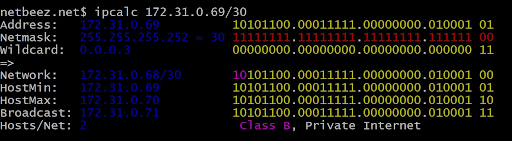

## Адресация. Продолжение
#### Классификация IP
Существует классификация IP адресов, как "частные" и "публичные". Под частные (они же локальные сети) сети зарезервированы следующие диапазоны адресов:
- *10.0.0.0* — *10.255.255.255* (*10.0.0.0/8* или *10/8*),
- *172.16.0.0* — *172.31.255.255* (*172.16.0.0/12* или *172.16/12*),
- *192.168.0.0* — *192.168.255.255* (*192.168.0.0/16* или *192.168/16*).
- *127.0.0.0* — *127.255.255.255* зарезервировано для петлевых интерфейсов (не используется для обмена между узлами сети), т.н. localhost

#### Порты
Для каждого из протоколов **TCP** и **UDP** стандарт определяет возможность одновременного выделения на хосте до 65536 уникальных портов,
идентифицирующихся номерами от 0 до 65535. Весь диапазон портов делиться на 3 группы:
- 0 до 1023, называемые привилегированными или зарезервированными (используются для системных и некоторых популярных программ)
- 1024 — 49151 называются зарегистрированными портами.
- 49151 — 65535 называются динамическими портами.

## Инструмент **ipcalc**
**ipcalc** is a utility that can perform simple manipulations of IPv4 addresses.
If you just type **ipcalc** without any input option, it will give you a nice ‘help’ output with some examples which are very helpful to get you started.

#### **ipcalc** Examples
Let’s look at some examples. If you give the IPv4 address as the input of your host, you will get the following output:

**ipcalc** picks up the netmask of the host and the output is pretty self explanatory.
The nice thing about **ipcalc** is that it gives the binary equivalents for each address which helps you to better visualize it.

The gap in the binary representation separates the network and the host part of the address.

You can also give the netmask as input, and here is a simple example of that:

Unfortunately, you can't give binary form of address as input of **ipcalc** :(

##### Subnets

One of the most useful capabilities of ipcalc is its ability to calculate network segments. Here is an example of how this works when we want to assign 10 and 20 addresses to two different subnets:

